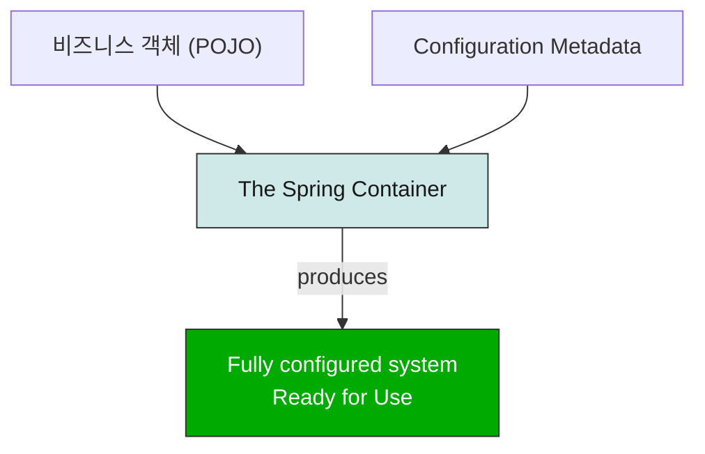

# Spring Framework는 어떻게 작동할까

## Spring의 핵심 기술들

### IoC Container

> 핵심: IoC Container는 의존성을 주입(DI)해주는 스프링 컨테이너입니다.

스프링의 핵심 기술 중 하나는 IoC 컨테이너입니다.

Spring IoC 컨테이너는 DI 방식으로 정의된 의존성들을 주입해주는 역할을 합니다. 

이 방식은 직접 객체를 생성하거나 Service Locator 패턴같은 매커니즘과는 반대되기에 '제어의 역전'이라고 불립니다.

> [!NOTE]
> IoC(Inversion of Control)는 프로그래밍 설계 원칙 중 하나로, 개발자가 직접 객체를 제어하던 것을 프레임워크에 위임하여 외부에서 제어하게 하는 기술입니다.
>
> DI(Dependency injection)는 IoC의 구현 형태 중 하나로, 객체들은 자신이 필요로 하는 의존성들을 생성자 매개변수나 팩토리 메서드의 인자, 또는 객체가 생성된 후에 설정되는 속성을 통해 외부에서 객체를 주입받는 디자인 패턴입니다.

IoC 컨테이너의 구현체로는

- BeanFactory 
- ApplicationContext

가 있습니다.

BeanFactory와 비교했을 때 ApplicationContext의 주요 차이점은 다음과 같습니다.

| 기능 | 설명 |
| --- | --- |
| AOP 통합 | `@Transactional`, `@Aspect` 지원 |
| MessageSource | 다국어(i18n) 메시지 처리 |
| EventPublisher | 이벤트 기반 통신 |
| WebApplicationContext | 웹 전용 Bean 관리 |

BeanFactory가 DI의 설정과 기본적인 구조만을 제공하는 데에 반해, ApplicationContext는 BeanFactory 이상의 추가적인 기능을 제공합니다. 현대에는 대개 ApplicationContext를 이용하여 개발합니다.

### Bean

> 핵심: Bean이란 IoC 컨테이너에 의해 관리되는 객체입니다.

Spring IoC 컨테이너에 의해 관리되는 객체들을 빈(bean)이라고 부릅니다. 

빈은 Spring IoC 컨테이너에 의해 생성(instantiated) 되고, 의존성이 주입되어 조립(assembled) 되며, 관리(managed) 되는 객체입니다.

빈과 빈 사이의 의존 관계는 컨테이너가 사용하는 설정 메타데이터(configuration metadata)에 반영됩니다.

### Container

> 핵심: Spring Container는 설정 정보와 객체를 받아 의존성을 연결하고 완성된 Bean들을 생성하는 IoC 컨테이너입니다.

ApplicationContext 인터페이스는 Spring IoC Container의 구현체로, 설정 메타데이터(configuration metadata)를 통해  Bean들을 생성(instantiating), 설정(configuring), 조립(assembling)하는 역할을 합니다.

설정 메타데이터는 다음과 같은 형태로 표현됩니다.

- 어노테이션이 붙은 컴포넌트 클래스 (예: `@Component`)
- 팩토리 메서드를 가진 설정 클래스
- 외부 XML 파일
- Groovy 스크립트

일반적으로 직접 Spring IoC 컨테이너를 생성하진 않습니다.

전통적인 Spring 웹 애플리케이션에서는 `web.xml`에 설정을 작성합니다.

Spring Boot에서는 일반적인 설정 규칙에 따라 ApplicationContext가 자동으로 생성되고 초기화됩니다.



애플리케이션 클래스와 설정 메타데이터가 결합되어 ApplicationContext가 생성되고 초기화되면, 완전히 설정되고 실행 가능한 시스템(애플리케이션)이 준비됩니다.

### Configuration Metadata

Spring IoC 컨테이너는 설정 메타데이터(configuration metadata)를 사용합니다.

이 설정 메타데이터는 애플리케이션 개발자가 Spring 컨테이너에게 애플리케이션의 컴포넌트를 어떻게 생성하고, 설정하고, 조립할지 알려주는 정보입니다.

#### Annotation-based configuration

컴포넌트 클래스에 어노테이션을 붙여 Bean을 정의합니다.

```java
@Service
public class UserService {
    ...
}

@Repository
public class UserRepository {
    ...
}
```

#### Java-based configuration

애플리케이션 클래스 외부에서 Java 설정 클래스를 사용해 Bean을 정의합니다.

```java
@Configuration
public class AppConfig {

    @Bean
    public PasswordEncoder passwordEncoder() {
        return new BCryptPasswordEncoder();
    }
}
```

#### Bean Definition

Spring 설정은 최소 하나 이상의 Bean Definition으로 구성됩니다.

Java 설정에서는 보통 `@Configuration` 클래스 안의 `@Bean` 메서드 하나가 Bean Definition 하나에 대응됩니다.

이러한 Bean Definition은 실제 애플리케이션을 구성하는 객체들에 대응됩니다.

- 서비스(Service) 계층의 객체들
- 영속성(Persistance) 계층의 객체들 (Repository, DAO 등)
- 웹(Presentation, 표현) 계층의 객체들 (Controller)
- 인프라 계층 (JPA, JMS 큐 등)

일반적으로 세부적인 도메인 객체(fine-grained domain objects)는 컨테이너에 등록하지 않습니다. (Entity, VO 등) 도메인 객체들을 생성하고 로드하는 것은 보통 레포지토리와 비즈니스 로직의 역할이기 때문입니다.

