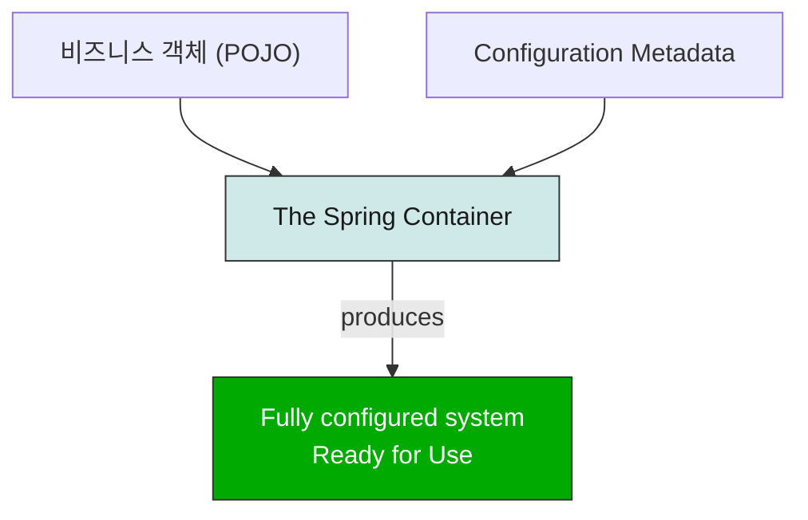
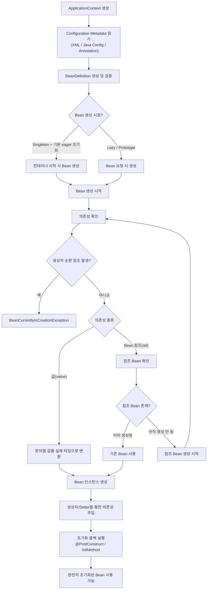
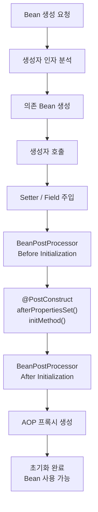
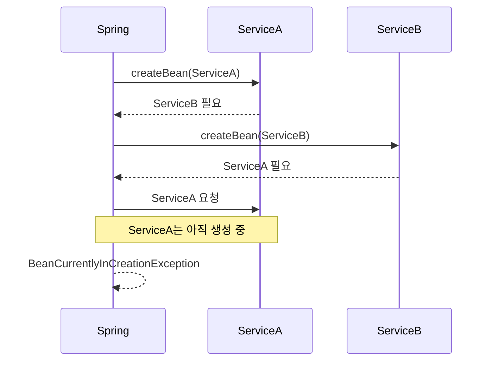
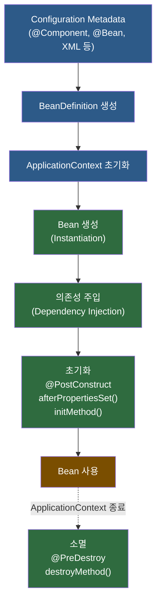

# Spring Framework는 어떻게 작동할까

> Spring의 핵심 기술들

## IoC Container

> 핵심: IoC Container는 의존성을 주입(DI)해주는 스프링 컨테이너입니다.

스프링의 핵심 기술 중 하나는 IoC 컨테이너입니다.

Spring IoC 컨테이너는 DI 방식으로 정의된 의존성들을 주입해주는 역할을 합니다. 

이 방식은 직접 객체를 생성하거나 Service Locator 패턴같은 매커니즘과는 반대되기에 '제어의 역전'이라고 불립니다.

> [!NOTE]
> IoC(Inversion of Control)는 프로그래밍 설계 원칙 중 하나로, 개발자가 직접 객체를 제어하던 것을 프레임워크에 위임하여 외부에서 제어하게 하는 기술입니다.
>
> DI(Dependency injection)는 IoC의 구현 형태 중 하나로, 객체들은 자신이 필요로 하는 의존성들을 생성자 매개변수나 팩토리 메서드의 인자, 또는 객체가 생성된 후에 설정되는 속성을 통해 외부에서 객체를 주입받는 디자인 패턴입니다.

IoC 컨테이너의 구현체로는

- BeanFactory 
- ApplicationContext

가 있습니다.

BeanFactory와 비교했을 때 ApplicationContext의 주요 차이점은 다음과 같습니다.

| 기능 | 설명 |
| --- | --- |
| AOP 통합 | `@Transactional`, `@Aspect` 지원 |
| MessageSource | 다국어(i18n) 메시지 처리 |
| EventPublisher | 이벤트 기반 통신 |
| WebApplicationContext | 웹 전용 Bean 관리 |

BeanFactory가 DI의 설정과 기본적인 구조만을 제공하는 데에 반해, ApplicationContext는 BeanFactory 이상의 추가적인 기능을 제공합니다. 현대에는 대개 ApplicationContext를 이용하여 개발합니다.

### Bean

> 핵심: Bean이란 IoC 컨테이너에 의해 관리되는 객체입니다.

Spring IoC 컨테이너에 의해 관리되는 객체들을 빈(bean)이라고 부릅니다. 

빈은 Spring IoC 컨테이너에 의해 생성(instantiated) 되고, 의존성이 주입되어 조립(assembled) 되며, 관리(managed) 되는 객체입니다.

빈과 빈 사이의 의존 관계는 컨테이너가 사용하는 설정 메타데이터(configuration metadata)에 반영됩니다.

## Container

> 핵심: Spring Container는 설정 정보와 객체를 받아 의존성을 연결하고 완성된 Bean들을 생성하는 IoC 컨테이너입니다.

ApplicationContext 인터페이스는 Spring IoC Container의 구현체로, 설정 메타데이터(configuration metadata)를 통해  Bean들을 생성(instantiating), 설정(configuring), 조립(assembling)하는 역할을 합니다.

설정 메타데이터는 다음과 같은 형태로 표현됩니다.

- 어노테이션이 붙은 컴포넌트 클래스 (예: `@Component`)
- 팩토리 메서드를 가진 설정 클래스
- 외부 XML 파일
- Groovy 스크립트

일반적으로 직접 Spring IoC 컨테이너를 생성하진 않습니다.

전통적인 Spring 웹 애플리케이션에서는 `web.xml`에 설정을 작성합니다.

Spring Boot에서는 일반적인 설정 규칙에 따라 ApplicationContext가 자동으로 생성되고 초기화됩니다.



애플리케이션 클래스와 설정 메타데이터가 결합되어 ApplicationContext가 생성되고 초기화되면, 완전히 설정되고 실행 가능한 시스템(애플리케이션)이 준비됩니다.

### Configuration Metadata

Spring IoC 컨테이너는 설정 메타데이터(configuration metadata)를 사용합니다.

이 설정 메타데이터는 애플리케이션 개발자가 Spring 컨테이너에게 애플리케이션의 컴포넌트를 어떻게 생성하고, 설정하고, 조립할지 알려주는 정보입니다.

#### Annotation-based configuration

컴포넌트 클래스에 어노테이션을 붙여 Bean을 정의합니다.

```java
@Service
public class UserService {
    ...
}

@Repository
public class UserRepository {
    ...
}
```

#### Java-based configuration

애플리케이션 클래스 외부에서 Java 설정 클래스를 사용해 Bean을 정의합니다.

```java
@Configuration
public class AppConfig {

    @Bean
    public PasswordEncoder passwordEncoder() {
        return new BCryptPasswordEncoder();
    }
}
```

### Bean Definition

Spring 설정은 최소 하나 이상의 Bean Definition으로 구성됩니다.

Java 설정에서는 보통 `@Configuration` 클래스 안의 `@Bean` 메서드 하나가 Bean Definition 하나에 대응됩니다.

이러한 Bean Definition은 실제 애플리케이션을 구성하는 객체들에 대응됩니다.

- 서비스(Service) 계층의 객체들
- 영속성(Persistance) 계층의 객체들 (Repository, DAO 등)
- 웹(Presentation, 표현) 계층의 객체들 (Controller)
- 인프라 계층 (JPA, JMS 큐 등)

일반적으로 세부적인 도메인 객체(fine-grained domain objects)는 컨테이너에 등록하지 않습니다. (Entity, VO 등) 도메인 객체들을 생성하고 로드하는 것은 보통 레포지토리와 비즈니스 로직의 역할이기 때문입니다.

## Bean

컨테이너 내부에서는 이러한 Bean 정의(Bean Definition)가 BeanDefinition 객체로 표현됩니다.

BeanDefinition 객체는 다음과 같은 메타데이터를 포함합니다.

<details>
<summary>BeanDefinition이 포함하는 메타데이터</summary>

### A package-qualified class name

패키지를 포함한 클래스 이름

일반적으로 Bean으로 정의되는 실제 구현 클래스의 이름입니다.

```java
com.example.user.UserService

// 실제 수행
new UserService()
```

### Bean behavioral configuration elements
Bean의 동작 방식을 정의하는 설정 요소

예를 들어 Scope, 생명주기 콜백 등이 포함됩니다.

```java
@Scope("prototype")
@PostConstruct
@PreDestroy
```

### References to other beans

해당 Bean이 동작하기 위해 필요한 다른 Bean에 대한 참조

이러한 참조를 collaborator 또는 dependency라고도 부릅니다.

```java
@Service
public class UserService {
    private final UserRepository repository;
    ...
}

/* 의존 관계 저장
UserService -> UserRepository */
```

### Other configuration settings

새로 생성되는 객체에 적용할 기타 설정값

```java
@Bean
public HikariDataSource dataSource() {
    HikariDataSource ds = new HikariDataSource();
    
    ds.setMaximumPoolSize(20);
    ds.setMinimumIdle(5);

    return ds;
}

/*
maximumPoolSize = 20
minimumIdle = 5
같은 설정도 BeanDefinition의 일부가 될 수 있음
*/
```
</details>

### BeanDefinition 주요 속성

| 속성 | 의미 |
| --- | --- |
| Class | 어떤 클래스를 생성할지 |
| Name | Bean 이름 |
| Scope | singleton, prototype 등 |
| Constructor arguments | 생성자 주입 값 |
| Properties | Setter 주입 값 |
| Autowiring mode | 자동 의존성 주입 방식 |
| Lazy initialization | 지연 생성 여부 |
| Initialization method | 초기화 메서드 |
| Destruction method | 소멸 메서드 |

<details>
<summary>상세 예시</summary>

### Class

```java
@Service
public class UserService {
}

// Class = UserService
```

### Name

```java
@Service
public class UserService {
}

// 기본 Bean 이름: userService
```

### Scope

```java
// 애플리케이션 전체에서 객체 1개
@Scope("singleton")

// 요청할 때마다 새 객체 생성
@Scope("prototype")
```

### Constructor Arguments

```java
@Service
public class UserService {
    public UserService(UserRepository repository) {
    }
}

// 생성자 파라미터: UserRepository
```

### Properties

```java
// Setter Injection
public class UserService {
    private UserRepository repository;

    public void setRepository(UserRepository repository) {
        this.repository = repository;
    }
}
```

### Autowiring Mode

```java
@Autowired
```

### Lazy Initialization

```java
@Lazy
@Service
public class UserService {
}

/*
기본: 애플리케이션 시작 시 생성
Lazy: 처음 사용할 때 생성
*/
```

### Initialization Method

```java
@PostConstruct
public void init() {
}

@Bean(initMethod = "init")

// Bean 생성 후 실행.
```

### Destruction Method

```java
@PreDestroy
public void close() {
}

@Bean(destroyMethod = "close")

// Bean 제거 직전에 실행.
```
</details>

빈은 생성 방식으로는 생성자 방식과 static factory method 방식이 있으나, 일반적인 spring boot 환경에서는 주로 생성자 방식을 통해 생성됩니다.

## Dependency

### Dependency Injection(DI)

의존성 주입(DI)은 객체가 자신의 의존성(즉, 함께 동작하는 다른 객체들)을 **생성자 인자**, **팩토리 메서드 인자**, 또는 객체가 생성된 후 설정되는 **프로퍼티**를 통해서 정의하는 과정입니다.

DI를 사용하면 코드가 더 깔끔해지고, 객체 간 결합도가 낮아집니다. 또한, 의존성의 위치나 구현체를 알 필요가 없어서 테스트에 용이합니다.

#### Constructor-based Dependency Injection

생성자 주입 방식은 컨테이너가 인자를 받는 생성자를 호출함으로써 이루어집니다. 각 인자는 하나의 의존성으로 취급됩니다.

```java
public class UserService {
    private final UserRepository repository;

    public UserService(UserRepository userRepository) {
        this.userRepository = userRepository;
    }
}
```

#### Setter-based Dependency Injection

Setter 주입 방식은 컨테이너가 생성하려는 빈의 인자가 없는 생성자를 호출한 후, setter 메서드를 호출함으로써 이루어집니다.

```java
public class UserService {
    private UserRepository repository;

    @Autowired
    public void setRepository(UserRepository repository) {
        this.repository = repository;
    }
}
```

의존성은 BeanDefinition 형태로 설정되며, PropertyEditor 인스턴스와 properties를 다른 형태로 변환할 때 사용됩니다. 하지만 개발자가 이를 직접 다루진 않습니다.

#### Constructor-based vs Setter-based DI

두 방식은 혼용 가능합니다. 스프링 팀은 일반적으로 생성자 주입 방식을 사용하길 권장하고 있습니다. 세터 메서드에 `@Autowired` 어노테이션을 사용하면 이는 필수 의존성이 되지만, 인자에 대한 검증이 가능한 생성자 방식이 더 권장됩니다.

- Immutable 객체 생성
    ```java
    private final UserRepository repository;

    public UserService(UserRepository userRepository) {
        this.userRepository = userRepository;
    }

    // 생성 후 변경 불가
    ```
    ```java
    userService.setRepository(...)
    // 언제든 변경 가능
    ```
- Null 방지
    ```java
    new UserService(repository)
    // repository가 없으면 객체가 생성되지 않음(필수)
    ```
    ```java
    UserService service = new UserService();
    // repository가 없을 수 있음(null)
    ```
- 완전히 초기화된 상태 보장

생성자 방식에서 너무 많은 인자는 한 클래스에 과도한 책임이 맡고 있음을 의미하며, 관심사의 적절한 분리를 위해 리팩토링해야 합니다.

### Dependency Resolution Process

의존성 해결 순서는 다음과 같습니다.



위 순서로 의존성이 주입되며, 실제 과정은 다음과 더 가깝습니다.



#### Circular dependencies

순환 참조란, 서로 다른 두 클래스 A와 B가 생성 시 서로의 인스턴스 주입을 필요로 하는 현상입니다. 해당 문제가 발생할 경우 서로의 생성자를 계속 호출하면서 무한 루프에 빠지게 되고, 스택 메모리의 한계에 도달한 뒤에야 StackOverflowError가 나타나게 됩니다.

```java
@RequiredArgsConstructor
@Service
public class ServiceA {

    private final ServiceB serviceB;

    public void methodA() {
        serviceB.methodB();
    }
    
}

@RequiredArgsConstructor
@Service
public class ServiceB {

    private final ServiceA serviceA;

    public void methodB() {
        serviceA.methodA();
    }
    
}
```

위와 같은 순환 참조가 발생하는 코드를 컴파일하면, 스프링부트는 자동으로 순환 참조 문제를 감지해서 애플리케이션이 시작하기 전에 에러가 나는 것을 막습니다.



### 다른 빈 주입 설정들

| 방식 | 특징 |
| --- | --- |
| `@DependOn()` | 특정 빈보다 먼저 생성되도록 강제 | 
| `@Lazy` | 빈 지연 초기화. 객체를 요청해야 빈 생성. 순환 참조 문제가 나중에 발생 | 
| Autowiring Collaborators | 자동 의존성 주입. 스프링이 알아서 주입해줌 | 
| Method Injection | Spring이 메서드 호출 시점에 의존성을 주입하는 기능 |

실제로 순환 참조가 발생한다면, 스프링은 이를 설계의 문제라고 봅니다.

## Bean Scope

빈 스코프란 Spring이 Bean 객체를 몇 개 만들고, 얼마나 오래 유지할 지 결정하는 설정입니다.

| Scope | 생성 시점 |
| --- | --- |
| singleton | 컨테이너당 1개, default |
| prototype | 요청할 때마다 새 객체 |
| request | HTTP 요청당 1개 |
| session | 세션당 1개 |
| application | ServletContext당 1개 |
| websocket | WebSocket 연결당 1개 |

<details>
<summary>왜 필요한가요?</summary>

```java
@Autowired
UserService userService1;

@Autowired
UserService userService2;
```

위 코드에서 둘은 같은 객체일까?

```java
userService1 == userService2
```
 
spring에서 두 코드는 기본적으로 같은 객체입니다. 왜냐하면 기본 scope가 `singletone`이기 때문입니다.

</details>

### Singleton

객체가 하나만 생성됩니다.

```java
@Scope("singleton")  // 쓰지 않아도 됨
@Service
class UserService
```

기본적으로 무상태(stateless)를 지향합니다.

### Prototype

매번 새로운 객체를 만듭니다.

```java
@Component
@Scope("prototype")
class TempObject
```

상태를 저장해야 하는 객체에 사용합니다.

spring이 라이프사이클을 관리하지 않아서 개발자가 직접 객체를 정리해주어야 합니다.

#### Singleton Bean과 Prototype Bean 의존성

```java
@Scope("prototype")
@Component
class PrototypeBean

@Service
class SingletonService(
    private val prototypeBean: PrototypeBean
)
```

싱글톤 스코프 Bean이 프로토타입 스코프 Bean에 의존하는 경우, 프로토타입 Bean을 계속 재사용합니다.

의존성은 Bean 생성 시점(instantiation time) 에 해결됩니다. 따라서 프로토타입 스코프 Bean을 싱글톤 스코프 Bean에 주입하면:

1. 새로운 프로토타입 Bean이 생성된다.
2. 해당 프로토타입 Bean이 싱글톤 Bean에 주입된다.
3. 이후 싱글톤 Bean은 그 프로토타입 인스턴스 하나만 계속 사용한다.

즉, 프로토타입 Bean이라고 해서 싱글톤 Bean 내부에서 사용할 때마다 새로 생성되는 것이 아닙니다.

만일 런타임 동안 여러 번 새로운 프로토타입 Bean이 필요하다면 Method Injection를 사용해야 합니다.


```java
// 새로운 Prototype Bean을 매번 받고 싶다면
// ObjectProvider 또는 @Lookup을 사용해야 함
@Service
class SingletonService(
    private val provider: ObjectProvider<PrototypeBean>
) {
    fun execute() {
        val prototype = provider.getObject()
    }
}
```

### Request

Http 요청마다 하나를 만듭니다.

```java
@RequestScope
class RequestContext(
    val traceId: String
)
```

### Session

사용자 세션마다 하나를 만듭니다.

```java
@SessionScope
@Component
class ShoppingCart
```

### Application

웹 애플리케이션(ServletContext) 전체에서 하나를 만듭니다.

```java
@ApplicationScope
@Component
class AppPreferences
```

singleton은 ApplicationContext 당 한 개를 생성합니다.

ServletContext는 여러개 생성될 수 있습니다.
햐
### WebSocket Scope

websocket 연결 시마다 하나를 생성합니다.

```java
@Scope("websocket")
@Component
class ChatSession
```

## 마무리

Spring은 객체 생성과 의존성 관리를 대신 수행하여 애플리케이션 개발에 집중할 수 있도록 도와주는 프레임워크입니다.

이번 시간에는 스프링 기술의 핵심인 IoC와 DI에 대해서 알아보았습니다.

Spring IoC Container가 객체를 대신 관리해줌으로써 수행함으로써 객체 간 결합도를 낮추고, 코드를 간결하게 만들어 유지보수성을 높일 수 있습니다.

Spring은 Configuration Metadata를 기반으로 BeanDefinition을 생성하고, 이를 통해 Bean을 생성, 조립, 관리합니다. 또한 Bean의 생명주기, 의존성 주입, 스코프 관리 등의 기능을 제공하여 애플리케이션 전반의 객체 관리를 담당합니다.

스프링의 흐름은 다음과 같습니다.



이러한 IoC Container 위에 Spring MVC, Spring Data JPA, Spring Security, AOP, Transaction과 같은 기술들이 동작하며, 현대 Spring Boot 애플리케이션의 기반을 구성합니다.

### 요약

```text
Spring
 └─ IoC Container(ApplicationContext)
      ├─ BeanDefinition 저장
      ├─ Bean 생성
      ├─ 의존성 주입(DI)
      ├─ Bean 생명주기 관리
      ├─ Scope 관리
      └─ 부가 기능 제공
          ├─ AOP
          ├─ Transaction
          ├─ Event
          ├─ MessageSource
          └─ WebApplicationContext

Bean
 ├─ 생성
 ├─ 의존성 주입
 ├─ 초기화
 ├─ 사용
 └─ 소멸

Scope
 ├─ Singleton
 ├─ Prototype
 ├─ Request
 ├─ Session
 ├─ Application
 └─ WebSocket
```

다음 시간에는 Annotation-based container configuration에 대해서 알아보겠습니다.