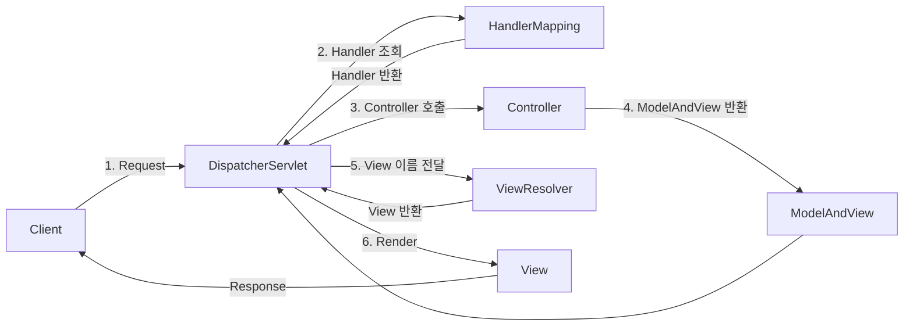
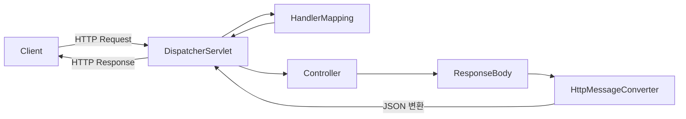

# Spring Web MVC에 대해서 알아보기

## 🌱Spring Web MVC란?

Servlet API를 기반으로 만들어진 웹 프레임워크로, Spring Framework의 웹 애플리케이션 개발 모듈입니다.

간단히 말해, HTTP 요청을 받아서 처리하고, 응답을 만들어주는 서버 개발용 프레임워크입니다.

### MVC란?

MVC는 소프트웨어 디자인 패턴으로, Model-View-Controller로 구성되어 있습니다.

해당 패턴은 소프트웨어의 비즈니스 로직과 화면을 구분하는데 중점을 두고 있으며, 세 가지 구성 요소는 다음과 같이 나뉩니다.

1. Model: 데이터와 비즈니스 로직
2. View: 레이아웃과 화면
3. Controller: 모델과 뷰로 명령 전달

MVC에 기반을 둔 다른 패턴으로는 `MVVM(Model-View-ViewModel)`, `MVP(Model-View-Presenter)`, `MVW(Model-View-Whatever)` 가 있습니다.

> [!IMPORTANT]
> MVC의 특징을 간단하게 정리해보세요.

```text
여기에 정리해보세요


```

## Spring Web MVC의 계층구조

```mermaid
flowchart TB
    DS["DispatcherServlet"]

    subgraph SWAC["Servlet WebApplicationContext"]
        C["Controllers"]
        VR["ViewResolver"]
        HM["HandlerMapping"]
    end

    subgraph RWAC["Root WebApplicationContext"]
        S["Services"]
        R["Repositories"]
    end

    DS --> SWAC
    SWAC -. "Delegates if no bean found" .-> RWAC

    classDef box fill:#080030,stroke:#6aa84f,stroke-width:2px;
    class DS,SWAC,RWAC,C,VR,HM,S,R box;
```


 


## Spring MVC의 동작 과정

* Spring Wev MVC


* Spring Boot REST API


전자는 Spring Web MVC의 흐름도로, Spring MVC에서 사용되던 흐름입니다.

후자는 Spring Boot REST API로, 과거 뷰를 반환하던 방식에서 데이터를 반환해주는 API 서버 개발용 애플리케이션입니다. 현대에서 Spring 개발 시 대개 해당 모듈을 사용합니다.

**실행 순서**
1. DispatcherServlet이 요청을 수신한다.
2. DispatcherServlet은 Handler Mapping에 어느 Controller를 사용할 것인지 문의한다.
3. DispatcherServlet은 요청을 Controller에게 전송하고 Controller는 요청을 처리한 후 결과를 리턴한다.
4. ModelAndView Object에 수행결과가 포함되어 DispatcherServlet에 리턴된다.
5. ModelAndView는 실제 JSP 정보를 갖고 있지 않으며, ViewResolver가 논리적 이름을 실제 JSP 이름으로 변환한다.
6. View는 결과정보를 사용하여 화면을 표현한다.


## Dispatcher Servlet

> [!CAUTION]
> 들어가기 전, Servlet이 무엇인지 찾아보고 이해한 내용을 한 줄로 설명해보세요.

```text
여기에 작성해보세요.


```

디스패처 서블릿은 HTTP 요청을 가장 먼저 받아서, 적절한 Controller에게 전달하고 결과를 응답으로 만들어주는 서블릿입니다.

### Dispatcher Servlet의 역할

#### 1. HandlerMapping 조회

요청에 적합한 Controller를 찾는 과정입니다. 요청이 들어올 때마다 어떤 컨트롤러로 요청을 보낼지 판단하는 역할을 합니다.

```http
POST /auth/login
```

API 요청이 들어올 경우, Handler Mapping을 조회하여 적합한 Controller를 찾아냅니다.

```java
@RestController
@RequestMapping("/auth")
public class AuthController {

    @PostMapping("/login")
    public void login(...) {}
}
```

2. Controller 호출

```java
@RestController
@RequestMapping("/auth")
public class AuthController {

    @PostMapping("/login")
    public void login(...) {}
}
```

HandlerMapping이 찾은 Controller를 DispatcherServlet이 호출한다.

Controller는 요청을 처리한 후 결과를 반환한다.

@PostMapping("/login")
public LoginResponse login(@RequestBody LoginRequest request) {
    return authService.login(request);
}
3. HandlerAdapter 실행

DispatcherServlet은 Controller를 직접 호출하지 않는다.

중간에 HandlerAdapter를 사용하여 Controller를 실행한다.

이는 다양한 형태의 Controller를 동일한 방식으로 처리하기 위해서이다.

DispatcherServlet
    ↓
HandlerAdapter
    ↓
Controller

Spring MVC 내부에서 자동으로 처리되므로 개발자가 직접 사용할 일은 거의 없다.

4. Controller 결과 반환

Controller는 요청 처리 후 결과를 반환한다.

전통적인 MVC에서는 ModelAndView를 반환한다.
```java
@GetMapping("/login")
public ModelAndView loginPage() {
    return new ModelAndView("login");
}
```

REST API에서는 객체를 반환한다.

```java
@GetMapping("/users/{id}")
public UserResponse getUser(@PathVariable Long id) {
    return userService.findById(id);
}
```
5. ViewResolver 또는 HttpMessageConverter 호출

#### MVC 방식

ViewResolver가 논리적인 View 이름을 실제 View로 변환한다.

```java
return new ModelAndView("login");
```
↓

`/WEB-INF/views/login.jsp`

#### REST API 방식

HttpMessageConverter가 객체를 JSON으로 변환한다.

```java
return new UserResponse("kusuri");
```

↓

```json
{
  "name": "kusuri"
}
```

대표적으로 `MappingJackson2HttpMessageConverter`가 사용된다.

6. 응답 반환

최종적으로 DispatcherServlet이 HTTP 응답을 생성하여 클라이언트에게 전달한다.

```
Client
    ↓
DispatcherServlet
    ↓
HandlerMapping
    ↓
HandlerAdapter
    ↓
Controller
    ↓
HttpMessageConverter
    ↓
Client
```