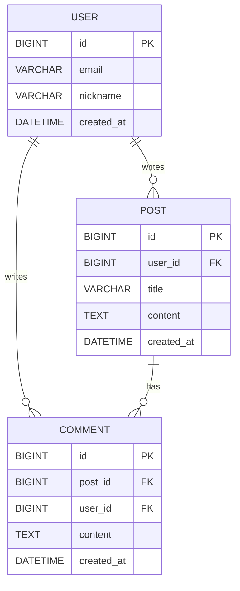

# ERD 및 테이블 설계하기

## ERD 작성하기 (mermaid)

- erdcloud.com
- draw.io

## 테이블 상세 설계

### User

| 컬럼명        | 타입           | PK | FK | NULL | 기본값               | 설명        |
| ---------- | ------------ | -- | -- | ---- | ----------------- | --------- |
| id         | BIGINT       | Y  | N  | N    | AUTO_INCREMENT    | 사용자 ID    |
| email      | VARCHAR(255) | N  | N  | N    |                   | 이메일       |
| nickname   | VARCHAR(50)  | N  | N  | N    |                   | 닉네임       |
| password   | VARCHAR(255) | N  | N  | N    |                   | 암호화된 비밀번호 |
| created_at | DATETIME     | N  | N  | N    | CURRENT_TIMESTAMP | 생성일       |
| updated_at | DATETIME     | N  | N  | Y    |                   | 수정일       |
