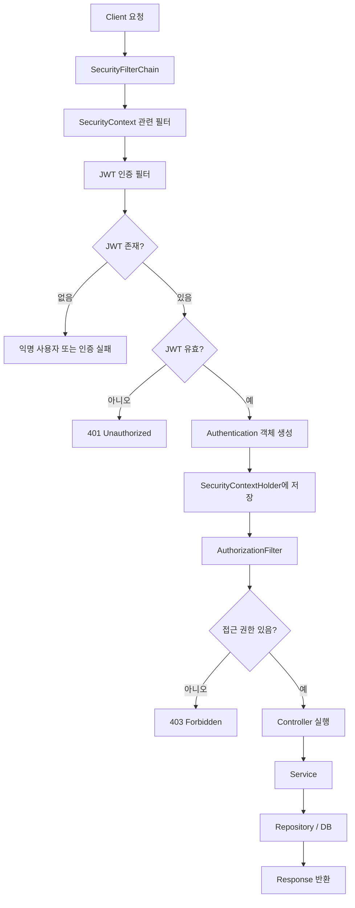

# Spring Security란?

Spring 애플리케이션의 인증(Authentication) 과 인가(Authorization) 를 담당하는 보안 프레임워크입니다.

실무에서는 사실상 다음 4가지를 위해 사용합니다.

1. 로그인 처리
2. JWT 인증
3. 권한(Role) 관리
4. 보안 공격 방어(CSRF, Session Hijacking 등)


## 주요 개념

| 개념                  | 설명           | 예시                |
| ------------------- | ------------ | ----------------- |
| Authentication      | 사용자가 누구인지 확인 | 로그인               |
| Authorization       | 접근 권한 확인     | ADMIN만 삭제 가능      |
| Principal           | 현재 로그인한 사용자  | User 객체           |
| GrantedAuthority    | 사용자 권한       | ROLE_ADMIN        |
| SecurityContext     | 인증 정보 저장소    | 현재 로그인 정보         |
| SecurityFilterChain | 보안 필터 모음     | JWT 검증            |
| UserDetails         | 사용자 정보 인터페이스 | CustomUserDetails |
| UserDetailsService  | 사용자 조회 서비스   | DB 조회             |
| PasswordEncoder     | 비밀번호 암호화     | BCrypt            |

## 구조 



```
Client
   ↓
Security Filter Chain
   ↓
Authentication
   ↓
Authorization
   ↓
Controller
```
Spring Security는 Controller보다 먼저 동작합니다.

## SecurityFilterChain

Spring Security는 Servlet Filter 기반으로 동작합니다.

```java
@Bean
public SecurityFilterChain securityFilterChain(HttpSecurity http)
        throws Exception {

    http
        .authorizeHttpRequests(auth -> auth
            .requestMatchers("/login").permitAll()
            .anyRequest().authenticated()
        );

    return http.build();
}
```

## JWT 인증 흐름

### 로그인

```
ID/PW 입력
    ↓
DB 검증
    ↓
JWT 발급
    ↓
Client 저장
```

### API 호출

```http
Authorization: Bearer xxx
```

위 정보를 헤더에 담아 전송

### JWT Filter
```java
public class JwtAuthenticationFilter extends OncePerRequestFilter
```

JWT 검증 과정:

```
토큰 존재 여부
    ↓
유효한지 판단
    ↓
Authentication 생성
    ↓
SecurityContext 저장
```
이후 Controller 실행

### SecurityContext

인증된 사용자 정보를 저장하는 일종의 저장소입니다.

모든 SecurityContext SecurityContextHolder에 들어있습니다.

현재 로그인한 사용자 조회:
```java
Authentication auth =
    SecurityContextHolder.getContext()
        .getAuthentication();
```
```java
// Authentication 객체에 로그인한 사용자의 정보가 담겨있습니다.
@GetMapping
public ResponseEntity<?> me(Authentication authentication) {
}
```

### Authentication 객체

현재 로그인 중인 상태를 의미합니다.

내부에 Principal, Authorities, Credentials, Authenticated가 들어있습니다.

| 항목            | 의미          | 예시                    |
| ------------- | ----------- | --------------------- |
| Principal     | 현재 로그인한 사용자 | User, UserDetails     |
| Credentials   | 인증 수단       | 비밀번호, JWT             |
| Authorities   | 권한 목록       | ROLE_USER, ROLE_ADMIN |
| Authenticated | 인증 성공 여부    | true, false           |

### Authorization

인가는 사용자의 권한을 확인하는 단계입니다. 단순 누구인지를 따지는 게 아닌, 사용자가 무엇을 할 수 있는지 판단한다는 점에서 인증과는 차이가 있습니다.

| 구분             | 질문           | 예시         |
| -------------- | ------------ | ---------- |
| Authentication | 누구인가?        | 로그인 성공     |
| Authorization  | 무엇을 할 수 있는가? | 관리자만 삭제 가능 |


```java
.authorizeHttpRequests(auth -> auth
    .requestMatchers("/admin/**")
    .hasRole("ADMIN")

    .requestMatchers("/user/**")
    .hasRole("USER")

    .anyRequest()
    .authenticated()
)
```

### Role vs Authority

| 구분    | Role        | Authority              |
| ----- | ----------- | ---------------------- |
| 의미    | 역할          | 세부 권한                  |
| 범위    | 큼           | 작음                     |
| 예시    | ADMIN, USER | DELETE_POST, READ_POST |
| 메서드   | hasRole()   | hasAuthority()         |
| 내부 표현 | ROLE_ADMIN  | DELETE_POST            |

Role은 이 사람이 어떤 사람인지 구분하고,

Authority은 이 사람이 어떤 작업을 할 수 있는지 구분한다는 점에서 차이가 있다.

Role은 관례적으로 문자열 앞에 `ROLE_` prefix를 붙인다.

### PasswordEncoder

비밀번호 암호화 

```java
@Bean
PasswordEncoder passwordEncoder() {
    return new BCryptPasswordEncoder();
}
```

```java
passwordEncoder.encode(password);
```

### CSRF

CSRF(Cross-Site Request Forgery)는 사용자가 의도하지 않은 요청을 서버에 보내게 만드는 공격이다.

#### 공격 예시

```
은행 사이트 로그인
↓
세션 쿠키 발급
↓
브라우저 저장
```
브라우저는 이후 요청마다 자동으로 쿠키를 보낸다.

사용자가 로그인한 상태에서 악성 사이트에 접속 시:

```html
<form action="https://bank.com/transfer" method="POST">
    <input name="to" value="attacker">
    <input name="amount" value="1000000">
</form>

<script>
document.forms[0].submit();
</script>
```

브라우저가 자동으로 수상한 요청을 보냄:
```http
POST /transfer

Cookie: JSESSIONID=abc123
```

은행 서버 접속 시:
```
세션 있음
↓
로그인 사용자 맞음
↓
송금 처리
```

---

그러나 브라우저는 헤더와 쿠키를 다르게 취급한다.

헤더는 자동 전송이 아니라 직접 전송해야하기 때문에 

세션 방식은 CSRF 위험이 존재하는 반면,

JWT같은 방식은 CSRF 위험이 거의 없다.

---

#### CSRF 위험이 거의 없기에 Spring Security는 CSRF를 비활성화하는 경우가 많습니다.

```java
http.csrf(AbstractHttpConfigurer::disable);
```

## Filter 순서
```
SecurityContextFilter
↓
JWT Filter
↓
UsernamePasswordAuthenticationFilter
↓
AuthorizationFilter
↓
Controller
```

## 정리

> Spring Security는 필터 기반으로 사용자를 인증(Authentication)하고 권한을 검사(Authorization)하는 보안 프레임워크입니다.

### 1. 동작 방식
SecurityFilterChain이 요청을 가로채고 Authentication으로 인증 후 Authorization으로 인가를 수행합니다.

### 2. JWT 검증 방법?
Custom Filter(JwtAuthenticationFilter)에서 검증 후 SecurityContextHolder에 Authentication을 저장합니다.

### 3. SecurityContextHolder는 왜 사용하나요?
현재 요청의 인증 정보를 저장하고 조회하기 위해 사용합니다.

### 4. Authentication과 Authorization 차이는?
Authentication은 사용자 확인, Authorization은 권한 확인입니다.
